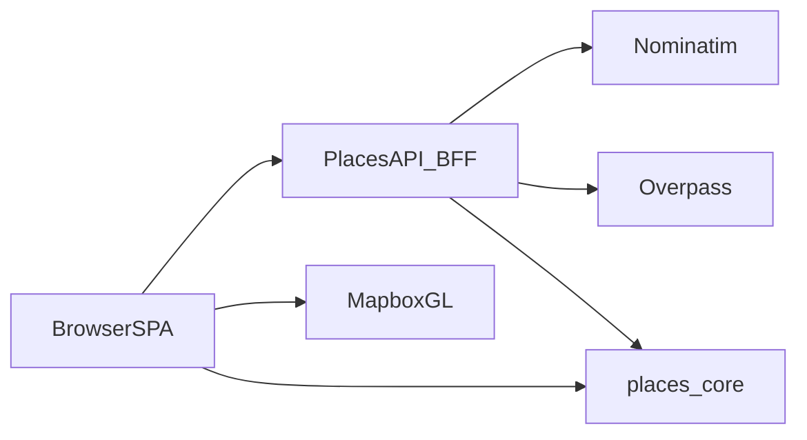
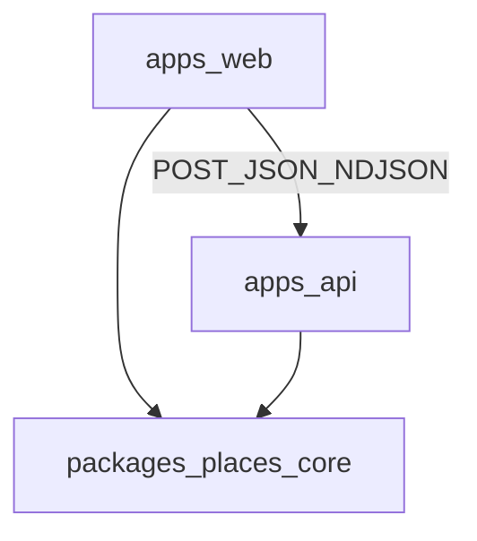
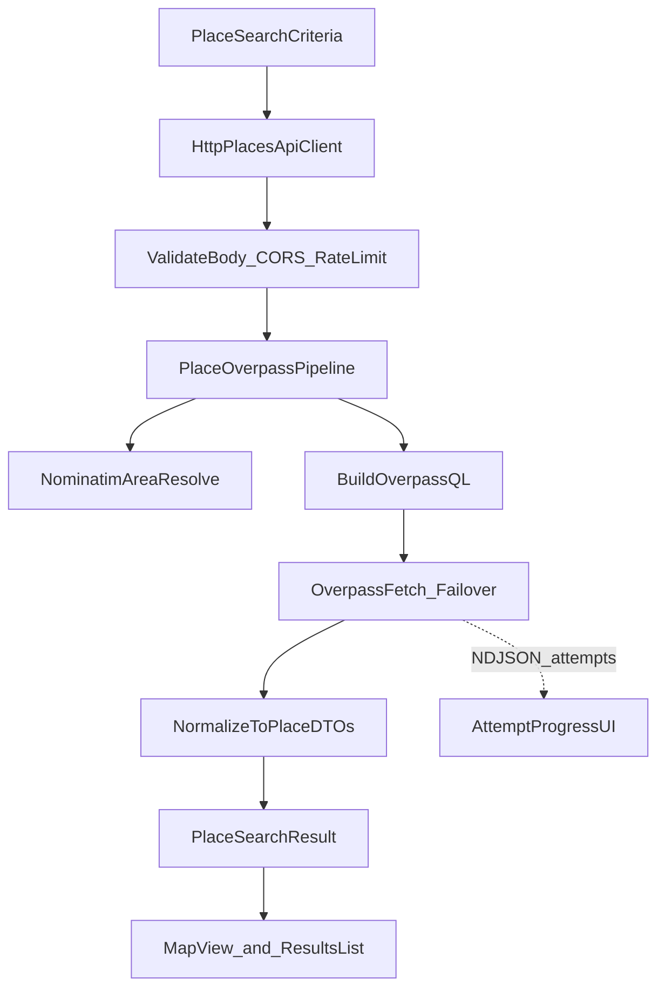
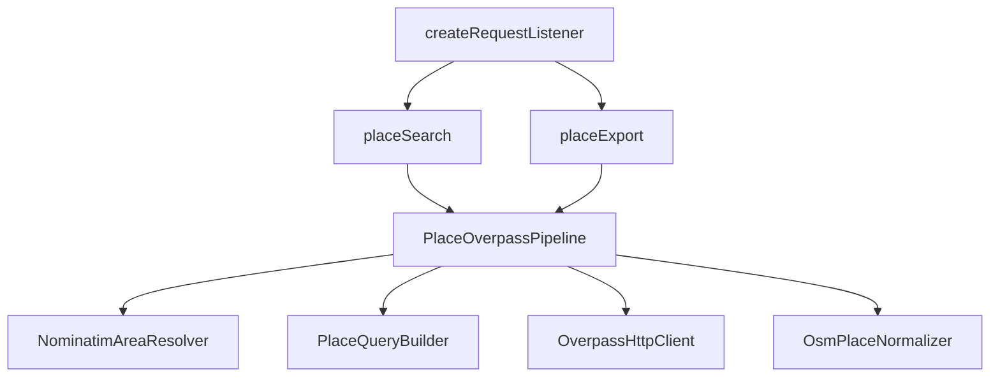
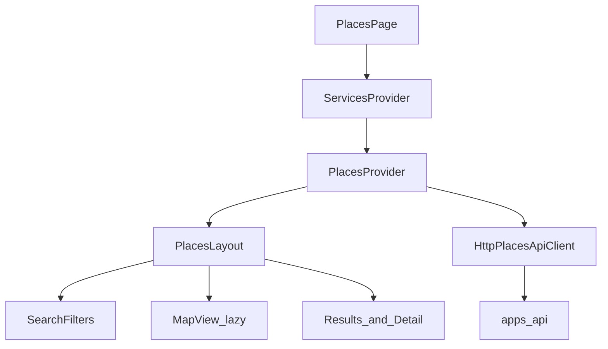

# Places architecture

This document gives the high-level system architecture of the Places monorepo.

## Purpose and scope

Places is a **Places explorer** for live OpenStreetMap data.
Users filter by industry, brand, name, geography, and optional OSM tags.
They browse results on a Mapbox map and in a side panel.
Overpass QL and Nominatim stay behind a Node BFF.

This file covers:

- Monorepo shape and package roles
- End-to-end search and export data flow (including NDJSON progress)
- BFF, SPA, and `places-core` module maps
- Hosting posture and hard invariants
- Verification and agent layout

This file does **not** cover:

- Full setup and env copy steps — see [README.md](../../README.md)
- BFF HTTP contracts, problem types, and env tables — see [places-api-bff](../skills/places-api-bff/SKILL.md) and [reference.md](../skills/places-api-bff/reference.md)
- SPA composition, Mapbox, and client posture — see [places-web](../skills/places-web/SKILL.md)
- Visual system and design tokens — see [DESIGN.md](DESIGN.md)
- Shared taxonomy and constants ownership — see [places-core](../skills/places-core/SKILL.md)
- Agent index — see [AGENTS.md](../../AGENTS.md)

## System context

The browser talks to the Places API and to Mapbox for map tiles.
The API is the only process that calls public Nominatim and Overpass.
Shared DTOs, taxonomy, and OSM constants live in `places-core`.

Runtime bar:

- Node.js `>=22`
- pnpm `11.8.0` (pinned via `packageManager`)
- `places-core` and `apps/api` use **zero** third-party runtime dependencies (Node builtins + workspace `places-core` only)
- Local development is first-class: API on `:8787`, Vite on `:5173`



## Monorepo packages

| Package | Role |
| ------- | ---- |
| [`apps/web`](../../apps/web) | Vite React SPA: filters, map, results, geometry export UI |
| [`apps/api`](../../apps/api) | Node HTTP BFF: validate, resolve area, query Overpass, stream progress, return DTOs |
| [`packages/places-core`](../../packages/places-core) | Shared types, taxonomy, countries, Overpass constants, geometry helpers |

Build order: `places-core` → `api` → `web` (`pnpm build`).



## High-level search flow

A Places search runs like this:

1. The user sets criteria in SearchFilters and clicks Search.
2. `PlacesProvider` calls `placeSearch.search` with an optional attempt listener.
3. `HttpPlacesApiClient` POSTs JSON to `/places/search` with `Accept: application/x-ndjson`.
4. The BFF validates the body, applies rate limits, and runs the Overpass pipeline.
5. Nominatim resolves country / region / city into a spatial scope when geography is set.
6. The API builds Overpass QL, queries mirrors with failover, and normalizes OSM elements to `Place` DTOs.
7. While Overpass attempts run, the API streams `overpassAttempt` NDJSON lines.
8. The final line is a `result` envelope (or a `problem` line on failure).
9. The SPA updates attempt status, then renders places on the map and in the list.

Export reuses the same pipeline shape via `POST /places/export` for geometry downloads.



## BFF module map

Entry: [`apps/api/src/server.ts`](../../apps/api/src/server.ts) wires config, `createApiServices`, and `createRequestListener`.

| Area | Path | Role |
| ---- | ---- | ---- |
| HTTP listener | [`create-app.ts`](../../apps/api/src/create-app.ts) | Routes, CORS, health, search/export handlers |
| DI graph | [`create-services.ts`](../../apps/api/src/create-services.ts) | Nominatim, Overpass, pipeline, search, export |
| Validation | [`validation/places-body.ts`](../../apps/api/src/validation/places-body.ts) | Allowlists and 422 field errors |
| Geocoding | [`services/geocoding/nominatim-area-resolver-service.ts`](../../apps/api/src/services/geocoding/nominatim-area-resolver-service.ts) | Admin area → bbox / osm id |
| Pipeline | [`services/places/place-overpass-pipeline-service.ts`](../../apps/api/src/services/places/place-overpass-pipeline-service.ts) | Assert filters → resolve → QL → query |
| QL builder | [`place-query-builder-service.ts`](../../apps/api/src/services/places/place-query-builder-service.ts) | Criteria → Overpass QL |
| Normalizer | [`osm-place-normalizer-service.ts`](../../apps/api/src/services/places/osm-place-normalizer-service.ts) | OSM elements → `Place` |
| Overpass client | [`services/overpass/overpass-http-client-service.ts`](../../apps/api/src/services/overpass/overpass-http-client-service.ts) | Timeouts, retries, mirror failover |
| Search / export | `place-search-service.ts`, `place-geometry-export-service.ts` | Domain facades over the pipeline |
| Rate limit | [`http/rate-limit.ts`](../../apps/api/src/http/rate-limit.ts) | Per-IP token bucket + concurrency |
| NDJSON | [`http/ndjson-progress.ts`](../../apps/api/src/http/ndjson-progress.ts) | Attempt / result / problem framing |
| Errors | [`http/problem.ts`](../../apps/api/src/http/problem.ts), [`map-domain-error.ts`](../../apps/api/src/http/map-domain-error.ts) | RFC 9457 problem+json |

Primary routes:

| Method | Path | Purpose |
| ------ | ---- | ------- |
| `POST` | `/places/search` | Map search (JSON or NDJSON) |
| `POST` | `/places/export` | Geometry export re-query |
| `GET` | `/health/live` | Liveness |
| `GET` | `/health/ready` | Readiness (process-level; upstreams not probed) |



## SPA module map

Composition root: [`apps/web/src/pages/Places/index.tsx`](../../apps/web/src/pages/Places/index.tsx) calls `createServices()`, then mounts `ServicesProvider` → `PlacesProvider` → `PlacesLayout`.

| Area | Path | Role |
| ---- | ---- | ---- |
| Services | [`services/create-services.ts`](../../apps/web/src/services/create-services.ts) | `AppServices`: search, export, taxonomy |
| HTTP | [`services/http/http-places-api-client.ts`](../../apps/web/src/services/http/http-places-api-client.ts) | BFF client; NDJSON framing |
| Places state | [`contexts/PlacesContext/`](../../apps/web/src/contexts/PlacesContext/) | Criteria, places, loading, attempts, map, selection |
| Services DI | [`contexts/ServicesContext/`](../../apps/web/src/contexts/ServicesContext/) | Injected ports |
| Layout | [`pages/Places/PlacesLayout/`](../../apps/web/src/pages/Places/PlacesLayout/) | Filters + lazy map + panel |
| Filters | [`pages/Places/components/SearchFilters/`](../../apps/web/src/pages/Places/components/SearchFilters/) | Hook + primary/advanced sections |
| Map | [`pages/Places/components/MapView/`](../../apps/web/src/pages/Places/components/MapView/) | Mapbox GL clusters; lazy `ExportGeometryModal` |
| Core UI | [`components/core/`](../../apps/web/src/components/core/) | Button, Input, Select, Modal, … |
| Tokens | [`styles/global.css`](../../apps/web/src/styles/global.css) | Dark green Places theme (Sora) |

Context slices (prefer the narrow hook):

| Hook | Concern |
| ---- | ------- |
| `usePlacesSearch` | Criteria, run/cancel, loading, error, places, attempts |
| `usePlacesMap` | Camera and fit-bounds |
| `usePlacesSelection` | Selected place |
| `usePlaces` | Full context for layouts |



## `places-core` module map

Barrel: [`packages/places-core/src/index.ts`](../../packages/places-core/src/index.ts).
Consumers import the package; after source changes, rebuild `dist/`.

| Area | Role |
| ---- | ---- |
| `types/places.types.ts` | `Place`, `PlaceSearchCriteria`, `PlaceSearchResult`, geocode/OSM shapes |
| `CATEGORY_DEFINITIONS` + `CategoryTaxonomy` | Industry taxonomy; **first-match** labeling |
| `COUNTRY_OPTIONS` | Full ISO 3166-1 alpha-2 list for the UI |
| `OSM_TAG_KEY_ALLOWLIST` | Advanced tag keys |
| Overpass / Nominatim constants | Endpoints, timeouts, retries, `RESULT_LIMIT` (2500) |
| Geometry utils | Normalization / WKT helpers for export |

Product rules that live here in spirit:

- Brand filter is an **exact** OSM `brand` match (plain text in the UI; no brand catalog).
- Place name is a **substring** filter.
- Category labels use **first-match** order in the taxonomy list, not a scored best industry.
- The API still accepts any 2-letter ISO country code; the UI offers the full static ISO set.

## Hosting posture

Local Node API + Vite web is the default path.
There is no Wrangler project in-repo today.

When hosting later:

- Serve the Vite `dist` on a static edge (for example Cloudflare Pages).
- Prefer **long-running Node or Containers** for Overpass wall-clock budgets (~180s).
- Cloudflare Workers are a poor fit for those budgets without a redesign.
- Edge rate limits may sit in front of the app-layer per-IP limits.

See [places-api-bff reference](../skills/places-api-bff/reference.md) for env and Cloudflare notes.

## Hard invariants

| Invariant | Why |
| --------- | --- |
| Browser never calls Nominatim or Overpass | Usage policy, CORS, and secrets stay on the server |
| API is the sole OSM outbound client | One identity, one retry/failover story |
| `places-core` has zero runtime deps | Shared contract stays portable and audit-small |
| API uses Node builtins only (no Express/zod) | Same zero-dependency BFF posture |
| Deploy web and API together | SPA casts co-versioned DTOs with light shape checks |
| Do not fork DTO shapes across packages | Change types once in `places-core` |

## Errors and contracts (high level)

The BFF returns RFC 9457 `application/problem+json` for failures.
Validation uses field-keyed `errors` on 422.
Upstream timeouts and mirror failures map to 504 / 502 problem types.
Rate limits return 429; concurrent Places caps return 503.

When the client asks for NDJSON, problems may also appear as a terminal stream line so the UI can stop progress cleanly.

Full `type` catalogue: [places-api-bff/reference.md](../skills/places-api-bff/reference.md).

## Verification and agent layout

Local verify commands (CI parity for product changes):

```bash
pnpm test
pnpm build
pnpm check
pnpm doctor:full
```

Targeted loops while editing:

```bash
pnpm --filter places-core test && pnpm --filter places-core build
pnpm --filter api test
pnpm --filter web exec vitest run <path>
```

Agent support lives under `.agents/`:

- `rules/` — monorepo and browser-OSM policy
- `skills/` — BFF, web, core, structure, SOLID, JSDoc, React Doctor
- `commands/` — reserved for verify/doctor slash commands (see [BACKLOG.md](../BACKLOG.md))
- `hooks/` — Biome and React Doctor after file edit
- `docs/` — this architecture file

See [AGENTS.md](../../AGENTS.md) for the full index.
